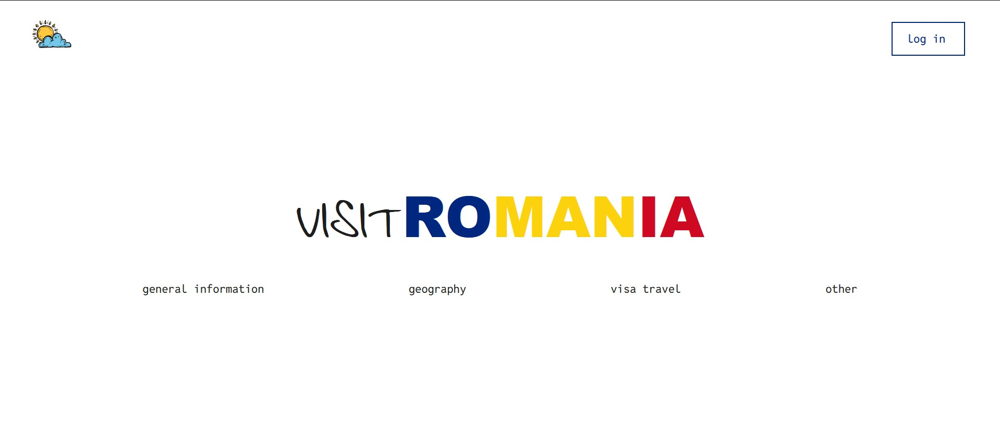

# Visit Romania

A web project about Romania, built with **HTML, CSS, JavaScript (frontend)** and **Node.js with Express (backend)**.  
It provides information about Romania (general facts, geography, visas, weather, etc.), along with a login/register system and interactive features.

---

## Screenshots

---

## Features
- General information about Romania (currency, language, culture)  
- Geography page with maps and climate info  
- Visa information (EU and international travelers)  
- Weather app (fetches live data with OpenWeather API, restricted to Romanian cities)  
- Authentication system (register/login with Passport.js and bcrypt)  
- Contact form + mini interactive game  

---

## Technologies Used
**Frontend:**
- HTML5
- CSS3 (responsive design)
- JavaScript (DOM manipulation, animations)

**Backend:**
- Node.js + Express
- Passport.js (authentication)
- bcrypt (password hashing)
- express-session + express-flash
- EJS templates

---

## Project Info
This project was created by **Ștefan Gabriel** as a **university assignment for the Web Technologies course** at the University of Bucharest.  
